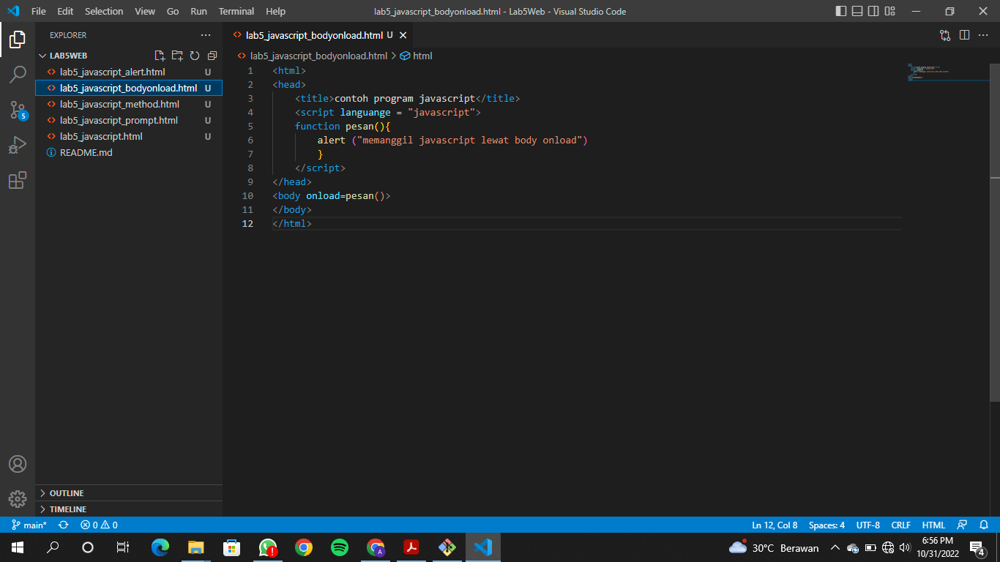
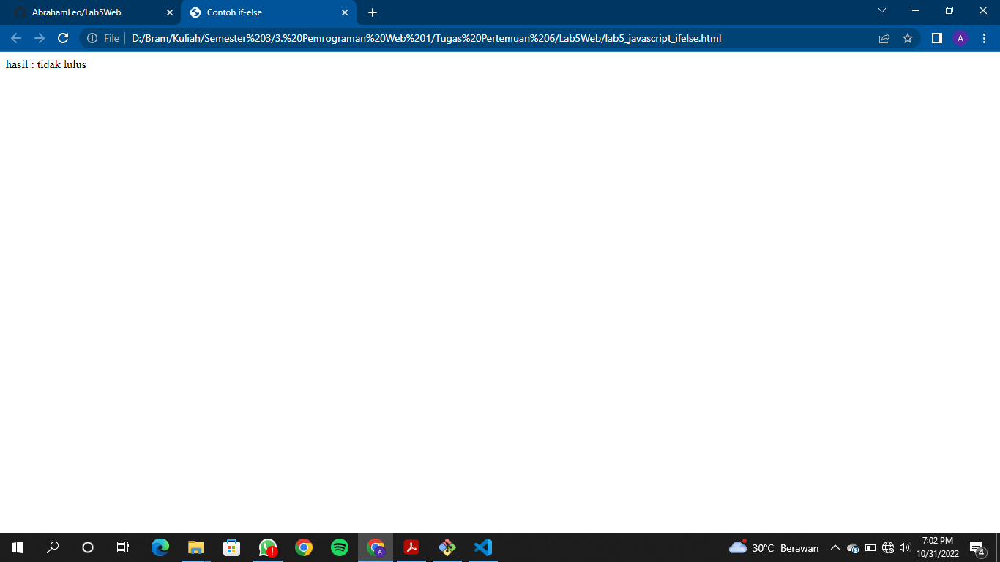

# Lab5Web

## Penggunaan Javascript
Persiapan membuat dokumen HTML dengan nama file lab5_javascript.html seperti berikut.
  
  

## Javascrip Dasar
Pemakaian Alert sebagai property window.
  
  
Pemakaian method dalam objek
  
  
Pemakaian Prompt
  
  
  
Pembuatan fungsi dan cara pemanggilannya
  
  

## Dasar Pemrograman Di Javascript
Operasi dasar aritmatika
  
  
Seleksi kondisi (if..else)
  
  
  
  
  
Penggunaan operator switch untuk seleksi kondisi
  
  

## Pembuatan Form
Form Input
  
  
Form Button.
  
  
  

## HTML DOM
Pilihan menggunakan checkBox dengan perhitungan otomatis
  
  